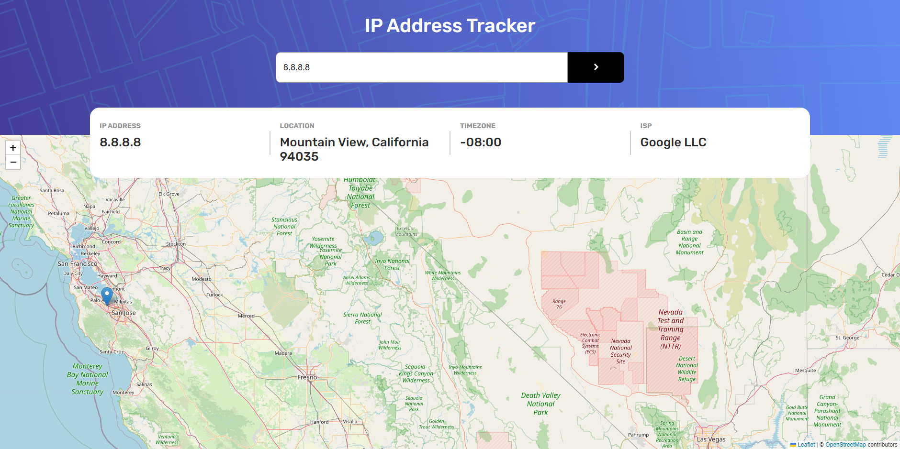

# Frontend Mentor - IP Address Tracker solution

This is a solution to the [IP Address Tracker](https://www.frontendmentor.io/challenges/ip-address-tracker-I8-0yYAH0).

## Table of contents

- [Overview](#overview)
  - [The challenge](#the-challenge)
  - [Screenshot](#screenshot)
  - [Links](#links)
- [My process](#my-process)
  - [Built with](#built-with)
- [Author](#author)

## Overview

### The challenge

The challenge was to recreate the IP Address Tracker based on a provided images. Website users should be able to:

- View the optimal layout for each page depending on their device's screen size
- See hover states for all interactive elements on the page
- See their own IP Address on the map on the initial page load
- Search for any IP addresses or domains and see the key information and location

### Screenshot

#### Preview

#### My solution

### Links

- Solution URL: [Add solution URL here](https://github.com/joaskr/ip-address-tracker)
- Live Site URL: [Add live site URL here](https://ip-address-tracker-cyan-eight.vercel.app)

## My process

### Built with

- React
- Leaflet.js and React Leaflet
- [Geolocation API](https://geo.ipify.org)
- Mobile-first approach

## Author

- Github - [@joaskr](https://github.com/joaskr)
- Frontend Mentor - [@joaskr](https://www.frontendmentor.io/profile/joaskr)

